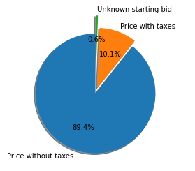
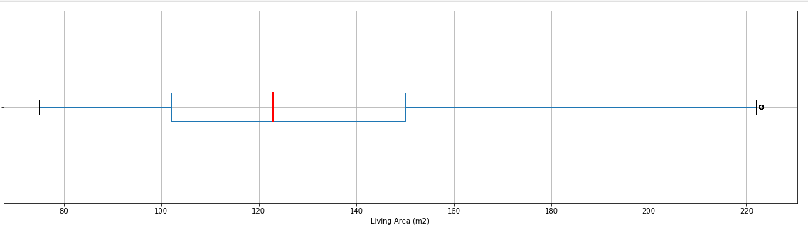
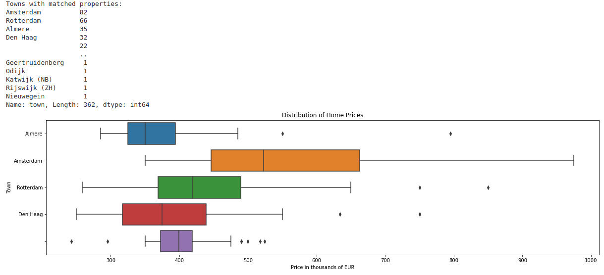

# Funda Analysis

## Description

Analysis of house pricing in the Netherlands by data received from [Funda](htts://funda.nl).

## Setup

Get [conda](https://conda.io) into your system.
The commands below will import the environment and activate it.

```shell
conda env create -f environment.yml
conda activate funda
```

## Pulling data

Call the following command from repository to pull data from [Funda](https://funda.nl):

```shell
cd scrapy
scrapy crawl funda -O dump.json
```

Where `funda` is a name of the spider and `dump.json` is a place where to store collected data.

## Historical data

## Analysis

Run [JupyterLab](https://jupyter.org/) and navigate to the analysis folder (JupyterLab is installed as part of environment):

```shell
jupyter-lab
```

Notebooks are located in the **analysis** folder.

## Examples

### Source price types



### General distribution of the Living Area



### Search price distribution

Filter data by buildings after 1990, 80-100 (m2) and not less than 20 properties per town.



Areas are not taken into account (as there are a lot of bad neighborhood in every city), but top 25% should give us approximate price of the property. Anyway it's a sandbox just to get starting bids, because real price is different.
